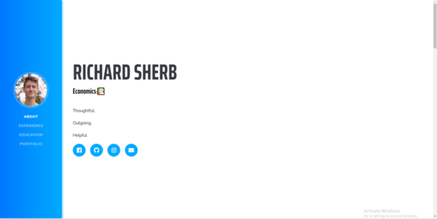

# Welcome to LearnCS8 Resume Website

This is an template website for you to fill in your own information. Follow the instructions at https://learncs8.com

Special thanks to the open source bootstrap libraries that made this website possible. 

## Richard Sherb's Resume

Richard's Resume was completed with the help of the learncs8 instructions and help from previous coding experience

Link: https://rickysherb.github.io/RichardSherb-Resume/

## Cloning

My template is just a clone of another resume sheet provided by CS8. As such, my template may also be used as a clone for others.

## Usage

Can be used for job interviews, personal reasons, etc etc.

## License

Just Kidding :)

## Preview

